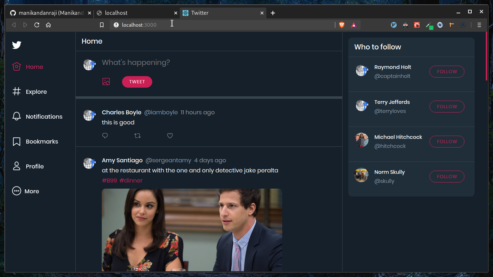
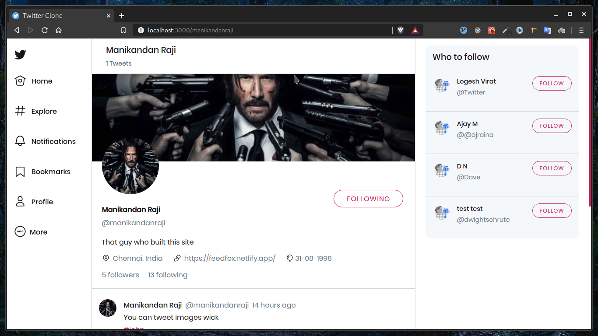
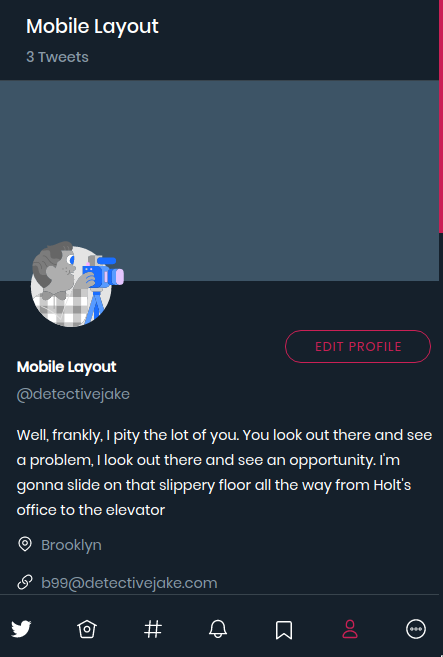

# Twitter Clone - Frontend

Built with React + Styled Components.
If you are looking for the backend repo, it lives here [backend](https://github.com/manikandanraji/twitter-clone-backend)

# The Stack

## Frontend
1. Frontend - Our beloved React
2. State Management - ApolloClient (requests, updating UI, caching)
3. Styling - Styled Components
4. Routing - React Router
5. Notifications - React Toastify
6. Popups- Reactjs popup

## Backend
1. Prisma - provides data modelling and a nice set of CRUD APIs to work with
2. GraphQLServer - graphql-yoga
3. Authentication - JWT 
4. Image upload - Cloudinary
5. Editor - the mighty "VIM" 

# You can do these things
- Login / Signup
- New Tweet
- Like
- Retweet
- Comment
- View Profile
- Edit Profile
- Search by users, tags, people
- Toggle between light and dark mode
- Cycle through five different accent colors

# Look at the UI

## Dark Mode

## Light Mode

## Mobile Layout

# TODO
- Real-time notifications using GraphQL subscriptions
- Bookmark tweeets
- Show retweets on user profile
- Show trending tags
- Better mobile support
- Add OLED theme
