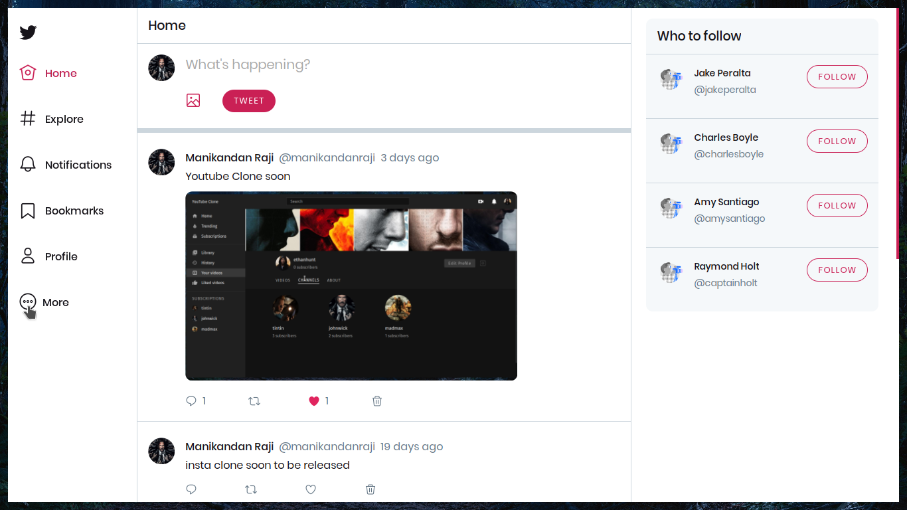
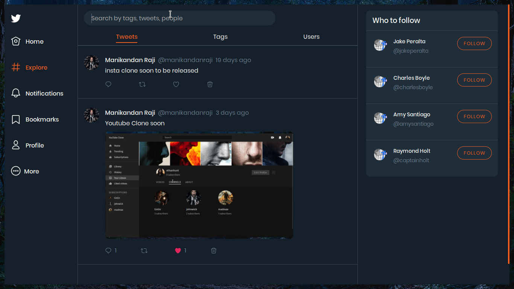
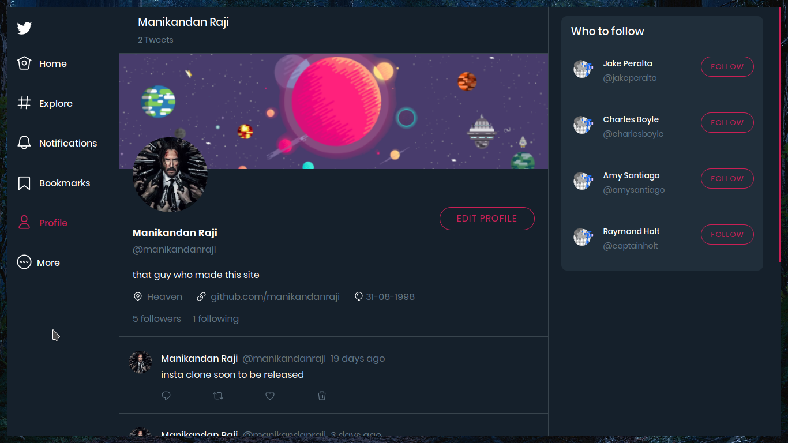
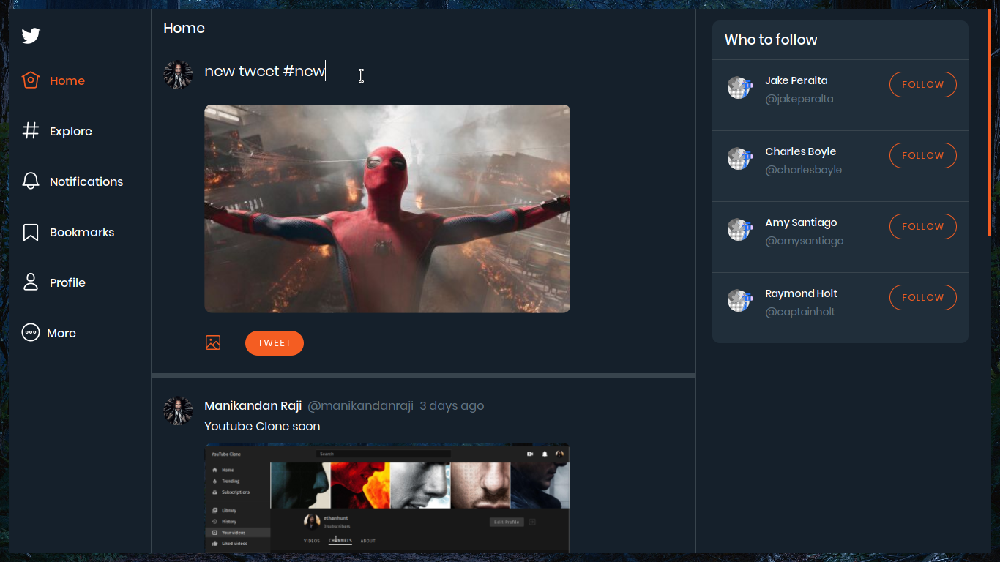
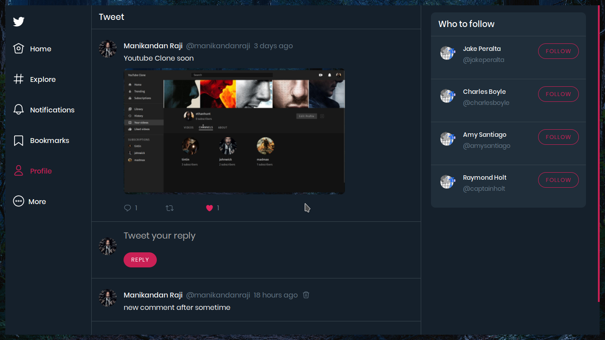

# Twitter Clone Frontend

[](https://app.netlify.com/sites/twitterclone22/deploys)

Twitter clone frontend built with React and Apollo Client

If you are looking for the backend repo, [click here](https://github.com/manikandanraji/twitter-clone-backend).

[Check out the deployed site](https://twitterclone22.netlify.com)

## Core Packages

1. apollo-client - state management, executing graphql queries and mutations, caching results
2. styled-components - styling
3. react-router - routing
4. react-toastify - toast notifications

## Features

- Login / Signup
- New Tweet
- Like
- Retweet
- Comment
- View Profile
- Edit Profile
- Search by users, tags, people
- Dark theme / Light theme

## How to setup locally

- Create a .env file at the root directory
- Make sure you have these variables setup

```js
REACT_APP_DEV=<DEV_ENDPOINT> 
REACT_APP_PROD=<PRODUCTION_ENDPOINT>
REACT_APP_CLOUDINARY_URL=https://api.cloudinary.com/v1_1/<YOUR_CLOUD_NAME>/image/upload
```

- Then run <code>npm install && npm start</code> to see the twitter clone in action.

## UI

## Home


## Explore


## Profile


## Edit Profile


## New Tweet


## Tweet

